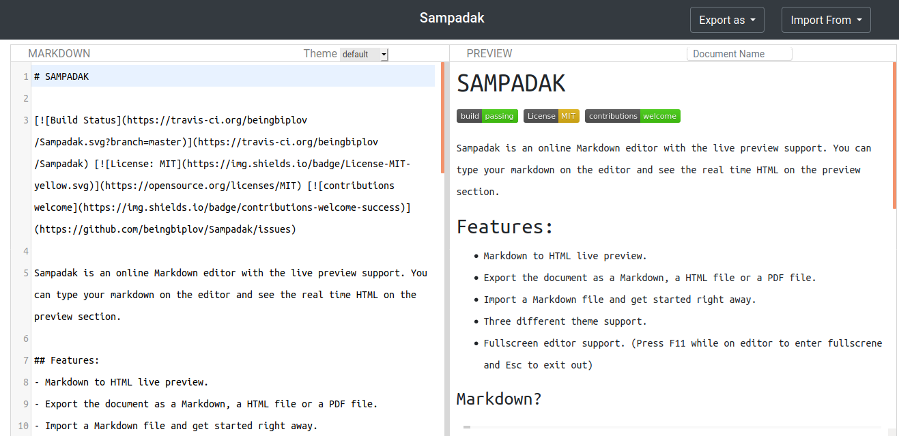

# SAMPADAK

  

Sampadak is an online Markdown editor with the live preview support. You can type your markdown on the editor and see the real time HTML on the preview section.

## Features:
- Markdown to HTML live preview.
- Export the document as a Markdown or an HTML file.
- Import a Markdown file.
- Three different theme support.
- Fullscreen editor support. (Press F11 while on editor to enter fullscrene and Esc to exit out)

   
   
  
   
   

### Markdown?
>Markdown is a text-to-HTML conversion tool for web writers. Markdown allows you to write using an easy-to-read, easy-to-write plain text format, then convert it to structurally valid XHTML (or HTML).
You can follow this [link] if you need any help with markdown syntax.

## Tech Stack
Sampadak make use of some awesome open source projects:
- [CodeMirror] : A versatile text editor implemented in JavaScript for the browser.
- [Showdownjs] : A Markdown to HTML bidirectional converter.
- [Bootstrap] : An open source toolkit for developing with HTML, CSS, and JS.
- [jQuery] :  A fast, small, and feature-rich JavaScript library.

## Want to contribute?
Sampadak is in early stages of development. You can report a bug or  recommend new features.
**You can help Sampadak be Great.**
 
## License
MIT

### *Build something Great Today!!*

[CodeMirror]: <https://codemirror.net/>
[Showdownjs]: <http://showdownjs.com/>
[Bootstrap]: <https://getbootstrap.com/>
[jQuery]: <https://jquery.com/>
[GitHub]: <https://github.com/>
[link]: <https://daringfireball.net/projects/markdown/syntax>
[live demo]: <https://beingbiplov.github.io/Sampadak/>
